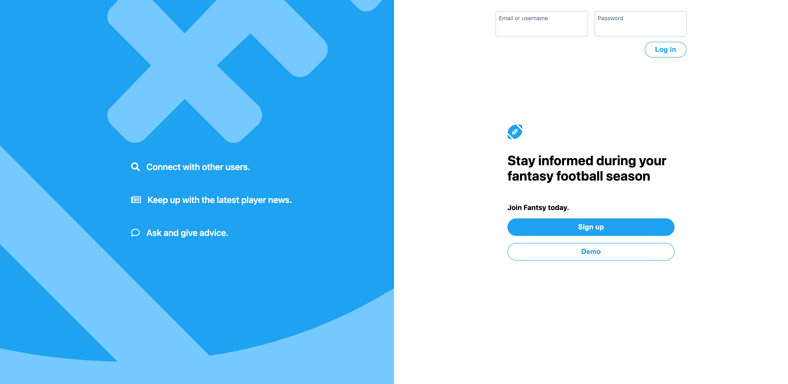
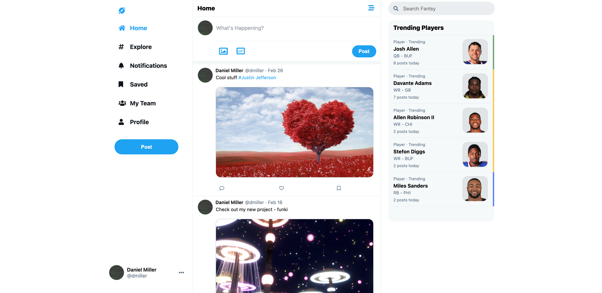
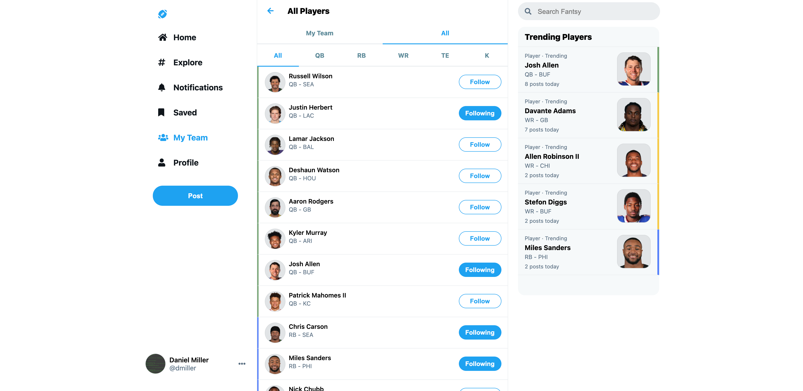
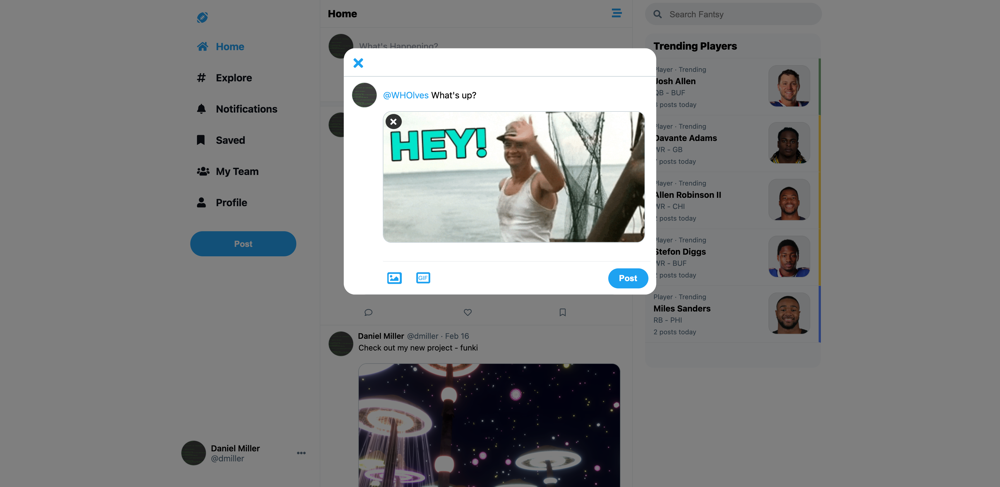
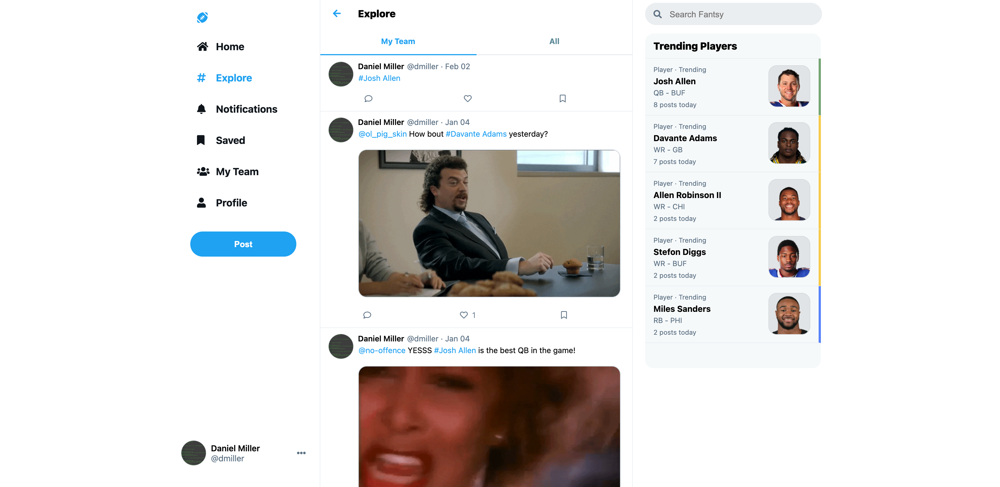
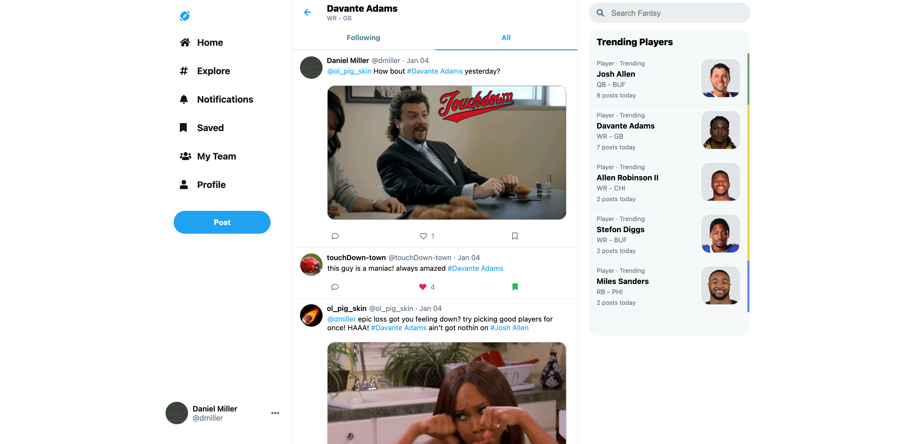
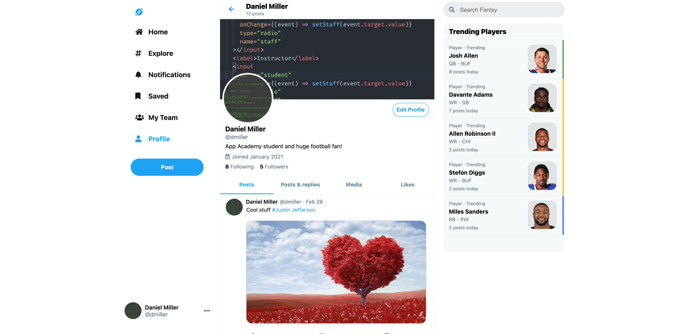

[![Stargazers][stars-shield]][stars-url]
[![Issues][issues-shield]][issues-url]
[![LinkedIn][linkedin-shield]][linkedin-url]

<!-- PROJECT LOGO -->
<br />
<p align="center">
  <a href="https://github.com/dbmille2/Fantsy">
    
  </a>

  <h3 align="center">Fantsy</h3>

  <p align="center">
    Fantsy is a social media platform with its core functionality inspired by [Twitter](https://twitter.com/).
    <br />
    <a href="https://github.com/dbmille2/Fantsy"><strong>Explore the docs »</strong></a>
    <br />
    <br />
    <a href="https://fantsy.herokuapp.com/">View Live Demo</a>
    ·
    <a href="https://github.com/dbmille2/Fantsy/issues">Report Bug</a>
    ·
    <a href="https://github.com/dbmille2/Fantsy/issues">Request Feature</a>
  </p>
</p>

<!-- TABLE OF CONTENTS -->
<details open="open">
  <summary><h2 style="display: inline-block">Table of Contents</h2></summary>
  <ol>
    <li>
      <a href="#about-the-project">About The Project</a>
      <ul>
        <li><a href="#built-with">Built With</a></li>
      </ul>
    </li>
    <li>
      <a href="#getting-started">Getting Started</a>
      <ul>
        <li><a href="#prerequisites">Prerequisites</a></li>
        <li><a href="#installation">Installation</a></li>
      </ul>
    </li>
    <li><a href="#usage">Usage</a></li>
    <li><a href="#roadmap">Roadmap</a></li>
    <li><a href="#contact">Contact</a></li>
  </ol>
</details>

<!-- ABOUT THE PROJECT -->

## About The Project

[![User Feed][product-screenshot]](https://fantsy.herokuapp.com/)

Fantsy is a social media platform for sharing fantasy football news, stats, and advice. Its core functionality is inspired by [Twitter](https://twitter.com/). Users can share posts including original content, or links to external sites containing helpful fantasy football news. Users have the ability to follow other users to curate what content they will see on their feed. Users can also follow player tags to keep up with all news pertaining to the players on their fantasy team. Be sure to check out the complete list of features below.

### Built With

- [React.js](https://reactjs.org/)
- [Redux.js](https://redux.js.org/)
- [Draft.js](https://draftjs.org/)
- [Express.js](https://expressjs.com/)
- [Sequelize](https://sequelize.org/)

<!-- GETTING STARTED -->

## Getting Started

To get a local copy up and running follow these simple steps.

### Prerequisites

- npm
  ```sh
  npm install npm@latest -g
  ```

### Installation

1. Clone the repo
   ```sh
   git clone https://github.com/dbmille2/Fantsy.git
   ```
2. Install NPM packages
   ```sh
   npm install
   ```
3. _psql_ commands:
  ```js
  CREATE USER <<username>> WITH PASSWORD '<password>' CREATEDB;
  CREATE DATABASE <<db_name>> WITH OWNER <<username>>;
  ```
4. Create a _.env_ file within the _backend_ directory containing the following code snippet:
  ```js
  DB_USERNAME = <<db_owner>>
  DB_PASSWORD = <<db_password>>
  DB_DATABASE = <<db_name>>
  DB_HOST = localhost
  JWT_SECRET = <<SECRET KEY>>
  JWT_EXPIRES_IN = 864000
  ```
5. Run pending migrations
   ```sh
   npx dotenv sequelize-cli db:migrate
   ```
6.  Run all pending seeds
    ```sh
    npx dotenv sequelize-cli db:seed:all
    ```

### Run the Express App

In both _backend_ and _frontend_ directories, run:

- npm
  ```sh
  npm start
  ```

<!-- USAGE EXAMPLES -->

## Usage

### Splash and Main Feed



### Team Selection and Post Modal



### Explore Feed and Player Feed



### Profile Page and Saved Posts



_For more examples, please refer to the [Documentation](https://github.com/dbmille2/fantsy)_

<!-- ROADMAP -->

## Roadmap

See the [open issues](https://github.com/dbmille2/fantsy/issues) for a list of proposed features (and known issues).

<!-- CONTACT -->

## Contact

Daniel Miller - [EMAIL](mailto:dbmiller25@gmail.com)

Project Link: [https://github.com/dbmille2/Fantsy](https://github.com/dbmille2/Fantsy)

<!-- MARKDOWN LINKS & IMAGES -->

[stars-shield]: https://img.shields.io/github/stars/dbmille2/fantsy.svg?style=for-the-badge
[stars-url]: https://github.com/dbmille2/fantsy/stargazers
[issues-shield]: https://img.shields.io/github/issues/dbmille2/fantsy.svg?style=for-the-badge
[issues-url]: https://github.com/dbmille2/fantsy/issues
[linkedin-shield]: https://img.shields.io/badge/-LinkedIn-black.svg?style=for-the-badge&logo=linkedin&colorB=555
[linkedin-url]: https://www.linkedin.com/in/daniel-miller-970393178/
[product-screenshot]: images/feed.png